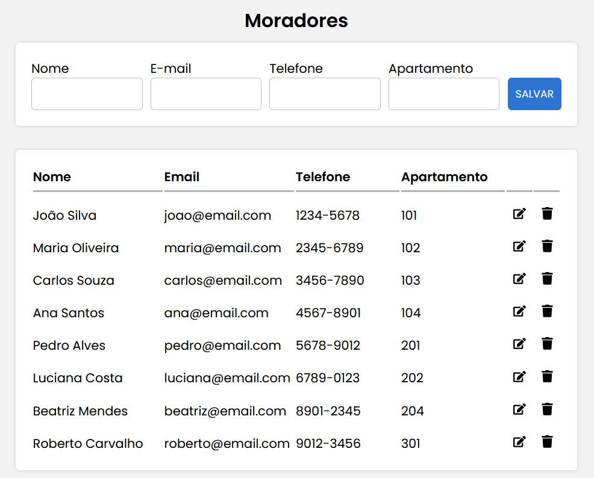

## TCC Engenharia de Software



# Sistema de Cadastro de Moradores

Este projeto é um sistema de cadastro de moradores desenvolvido com ReactJS, NodeJS e MySQL. Ele permite cadastrar, editar, excluir e visualizar informações dos moradores de um condomínio.

## Diagrama de Caso de Uso

```plaintext
+-----------------------------+
|       Sistema de Cadastro   |
|        de Moradores         |
+-----------------------------+
|                             |
|  +----------------------+   |
|  | Administrador        |   |
|  +----------------------+   |
|          ^   ^   ^   ^      |
|          |   |   |   |      |
|          |   |   |   |      |
|          |   |   |   |      |
|  +-------+---+---+---+------+|
|  |                        |  |
|  |  Cadastrar Morador     |  |
|  |  Editar Morador        |  |
|  |  Excluir Morador       |  |
|  |  Visualizar Moradores  |  |
|  |                        |  |
+-----------------------------+
```

# Arquitetura do Software

A arquitetura do software segue um modelo cliente-servidor típico para aplicações web fullstack, composto por três camadas principais:

## Camada de Apresentação (Frontend)

- **Tecnologia Utilizada**: ReactJS
- **Descrição**: Esta camada é responsável pela interface do usuário, permitindo a interação dos usuários com o sistema. Através de componentes React, os usuários podem visualizar, cadastrar, alterar e excluir informações de moradores.

## Camada de Lógica de Negócios (Backend)

- **Tecnologia Utilizada**: NodeJS com Express
- **Descrição**: Esta camada processa as requisições dos usuários e interage com a camada de dados. Implementa a lógica de negócios para operações de CRUD (Create, Read, Update, Delete) dos moradores. As requisições HTTP são gerenciadas utilizando a biblioteca Express.

## Camada de Dados (Database)

- **Tecnologia Utilizada**: MySQL
- **Descrição**: Esta camada armazena os dados persistentes do sistema, como informações dos moradores. Utiliza um banco de dados relacional para garantir a integridade e a consistência dos dados.

# Tecnologias Utilizadas

## Frontend

- **ReactJS**: Biblioteca JavaScript para construção da interface de usuário.
- **Styled-components**: Biblioteca para estilização dos componentes React.
- **React-Toastify**: Biblioteca para exibição de notificações.
- **Axios**: Biblioteca para fazer requisições HTTP ao backend.

## Backend

- **NodeJS**: Ambiente de execução JavaScript do lado do servidor.
- **Express**: Framework para construção de APIs web em NodeJS.
- **MySQL**: Sistema de Gerenciamento de Banco de Dados relacional.
- **Dotenv**: Biblioteca para carregar variáveis de ambiente a partir de um arquivo .env.

# Requisitos de Implantação

## Ambiente de Desenvolvimento

- Node.js instalado.
- MySQL instalado e configurado.
- Ferramentas de build para React (como Create React App).

## Ambiente de Produção

- Servidor Node.js em execução.
- Instância do banco de dados MySQL acessível.
- Servidor web configurado (como Nginx ou Apache) para servir a aplicação frontend.
- Acesso às variáveis de ambiente necessárias (configuradas no servidor de produção).

## Configuração do Ambiente

- **Variáveis de Ambiente**: Configuração das variáveis de ambiente para conectar ao banco de dados MySQL.
  - `DB_HOST`: Host do banco de dados.
  - `DB_USER`: Usuário do banco de dados.
  - `DB_PASSWORD`: Senha do banco de dados.
  - `DB_DATABASE`: Nome do banco de dados.

## Deploy

- Deploy do backend (NodeJS/Express) em um servidor de aplicação.
- Deploy do frontend (ReactJS) em um serviço de hospedagem estática ou servidor web.

## Script para criação do banco de dados

```sql
CREATE TABLE moradores (
    id INT NOT NULL AUTO_INCREMENT,
    nome VARCHAR(200) NOT NULL,
    email VARCHAR(200) NOT NULL,
    fone VARCHAR(25) NOT NULL,
    apartamento VARCHAR(25) NOT NULL,
    PRIMARY KEY (id)
);
```
